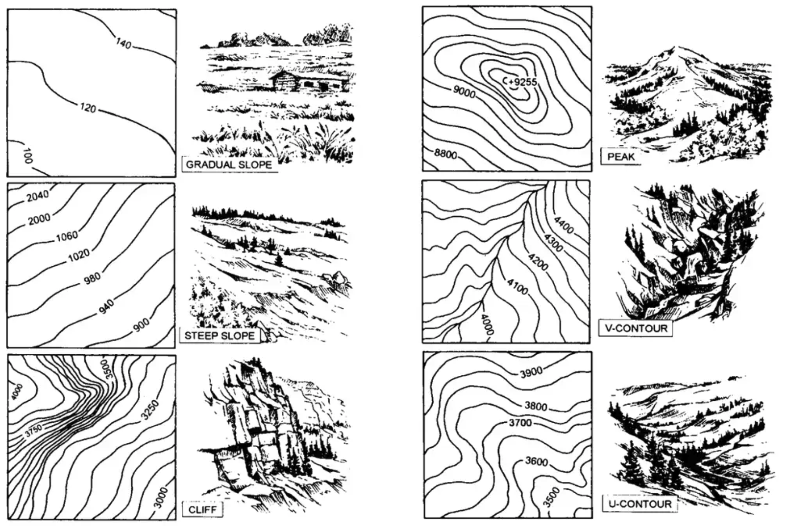
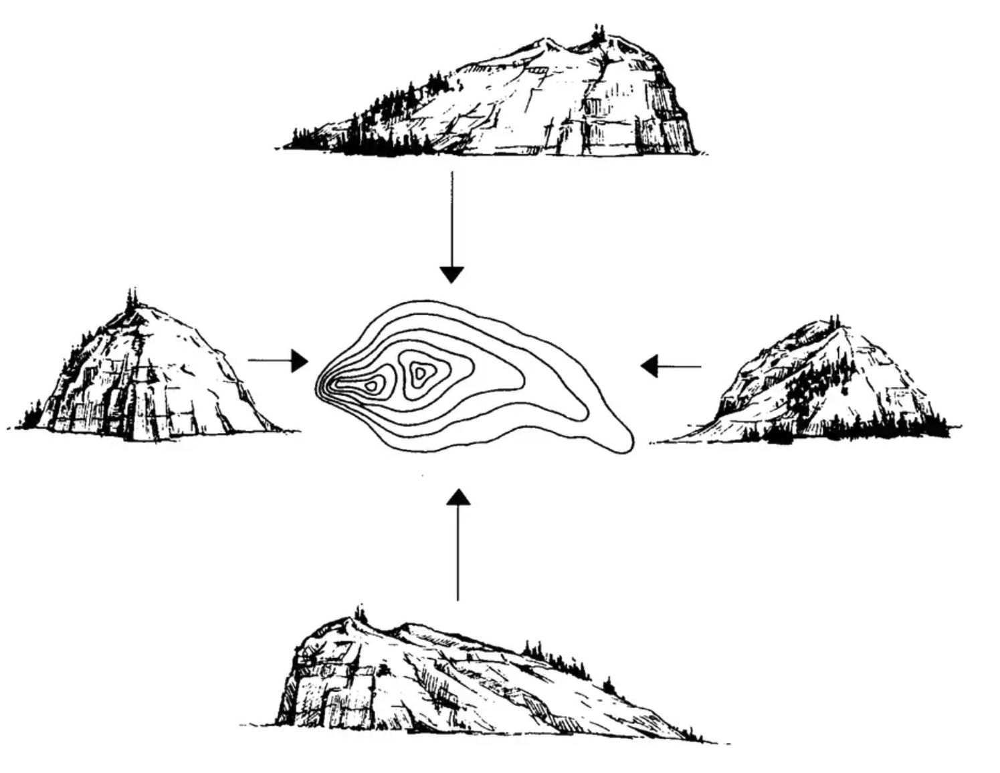
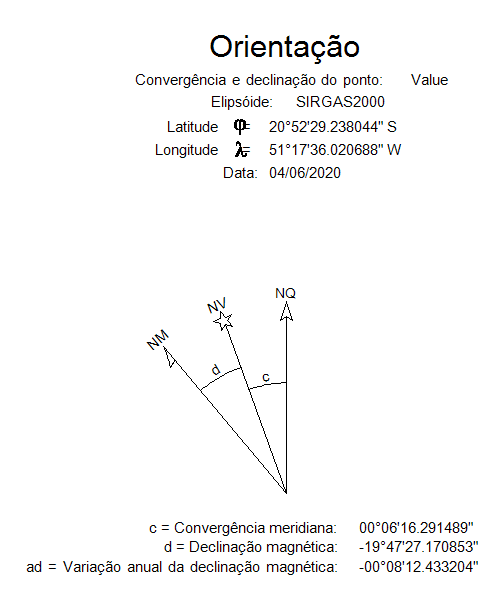
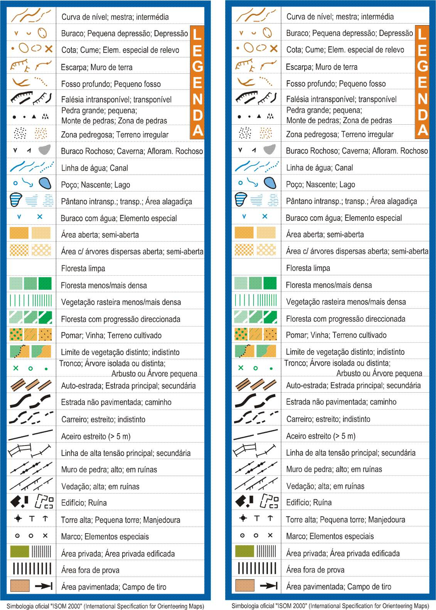
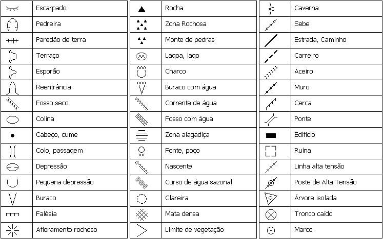

# Orientação

<h4>Núcleo de Leiria</h4><h4>Manual de Orientação</h4>

## Termos Importantes

**Elevação**: É a altura de um ponto da superfície da Terra em relação ao nível do mar.

**Azimute**: É um ângulo observado no sentido horario, medido geralmente em graus, a partir do norte, apesar de poder ser medido a partir de qualquer meridiano de referencia.

**Curvas de Nível**: São linhas em um mapa que conectam pontos de igual elevação. Elas são usadas para representar a topografia e a inclinação do terreno.

**Norte Magnético**: É a direção para a qual a agulha de uma bússola aponta, influenciada pelo campo magnético da Terra. Ele não coincide exatamente com o norte geográfico devido às variações magnéticas da Terra.

**Norte Verdadeiro**: Por vezes também chamado de Norte Geográfico, é a direção exata do polo Norte geográfico a partir de um dado ponto.

**Declinação**: Também conhecida como variação magnética, é a diferença angular entre o norte magnético e o norte verdadeiro. Varia de acordo com a localização geográfica e ao longo do tempo devido a mudanças no campo magnético da Terra.

**Escala**: A escala indica a relação proporcional entre a distância no mapa e a distância correspondente na realidade. Por exemplo, uma escala de 1:10000 significa que 1 centímetro no mapa representa 100 metros no terreno real. As escalas que vão mais regularmente encontrar são de 1:25000 (1cm no mapa representa 250m), e 1:50000(1cm no mapa representa 500m).

**Medida**: Refere-se ao ato de determinar a dimensão, extensão ou tamanho de algo, geralmente usando alguma técninca ou equipamento (exemplo: uma régua ou escala).

**Distância**: É o espaço entre dois pontos ou objetos. Em geografia, é frequentemente medida em unidades como metros ou quilômetros.

**Formato do terreno**: Refere-se às características físicas e à configuração da superfície do terreno, incluindo montanhas, vales, planícies e outros relevos.

**Azimute dorsal**: !!Pending

## Mapa Topográfico

#### O que é um mapa topográfico

Um mapa topográfico é uma representação detalhada de uma área da superfície da Terra, que mostra várias características tanto naturais quanto artificiais sobre o terreno.

#### Utilidade de um mapa topográfico

!!Pending...

#### Caracteristicas de um mapa topográfico

Existem algumas características que conseguimos encontrar num mapa topográfico:

##### Área de representação

Indica a área de abrangência do mapa e seus limites. Encontra-se na margem superior. Indica o nome do mapa.
Nas extremidades das bordas, indica a latitude e a longitude extremas do mapa.

##### Escala

A escala do mapa representa a relação entre cada unidade do mapa e o tamanho real. As escalas que vão mais regularmente encontrar são de 1:25 000 (1cm no mapa representa 250m), e 1:50 000 (1cm no mapa representa 500m). Isto não significa que não vão encontrar outras escalas (por exemplo 1:10 000; 1:100 000; etc...). Mapas com uma escala maior vão ter mais detalhe, mas cobrem uma área menor, enquanto mapas com uma escala menor vão ter menos detalhe, mas conseguem cobrir mais área no mesmo espaço.

_Curiosidade_: Para representar Portugal inteiro(incluindo ilhas), é usado uma escala de [1:2 500 000](./2500k.jpg).

###### Escalímetro

O escalímetro é uma régua graduada em diferentes escalas, facilitando a leitura de distâncias no mapa. Apresenta as distâncias diretamente na escala real, evitando assim a necessidade de cálculos. Caso a régua não possua a escala do nosso mapa, utiliza-se uma escala proporcional. Por exemplo, podemos usar a escala de 1:10 000 e multiplica os valores por 10 para encontrar a escala de 1:100 000.

##### Curvas de Nível

As curvas de nível conectam pontos de mesma elevação, representando a topografia da região. As curvas de nível estão igualmente espaçadas e representam altitudes específicas, conforme a representação de cada mapa.
Curvas de nível mais próximas representam características geográficas mais bruscas, como um penhasco, enquanto curvas de nível mais distantes representam variações graduais e leves de altitude, como uma encosta pouco acentuada de uma colina.

_Nota_: Atenção, podem existir características geográficas que não estejam representadas pelo mapa topográfico, se a variação de altura for menor que a distancia das curvas de nível, ou
seja, desde que esteja compreendido entre duas curvas de nível.

##### Coordenadas geográficas

Para localizar um ponto, é necessário conhecer a distância deste, em relação a dois outros pontos conhecidos. Em cartografia, usa-se o equador como o eixo _X_ do plano cartesiano e os meridianos (meridiano de Greenwich - meridiano zero - ou meridianos de referência do UTM) como o eixo _y_ do plano cartesiano.

_Exemplo_: As coordenadas da nossa Igreja em longitude e latitude são: W 8º 48'33" N 39º 43'93". Lê-se: 8 graus, 48 minutos, 33 segundos oeste; 39 graus, 43 minutos, 39 segundos norte.

###### Longitude e Latitude

Este é o sistema mais utilizado pelos cartógrafos em torno do mundo. Qualquer mapa produzido, em geral, apresenta-o como o principal sistema de coordenadas.
**Longitude** é a distância, em graus, em relação à linha do primeiro meridiano, ou meridiano zero, que passa pela cidade de Greenwich, Inglaterra. Existem longitude leste e longitude
oeste (ex. W 43° 01' 50").
**Latitude** é a distância em graus em relação ao equador. Podemos ter latitude norte e latitude sul. (Ex. N 22º 27' 42").

##### Declinação Magnética

As bússolas são orientadas ao **norte magnético**, enquanto os mapas são orientados para um ponto diferente, o **norte geográfico** (norte verdadeiro, eixo de rotação da
terra)'. A diferença entre ambos é chamada de _declinação magnética_. Esta declinação magnética varia conforme a sua localização no globo e cada mapa tem sua própria declinação magnética.

<strong>Figura 1 - </strong>Declinação magnética no mapa

Na figura _X_, conseguimos ver um exemplo de uma legenda comum que se encontra num mapa topográfico. Como podemos verexistem na verdade três nortes representados, _NM_ é o norte magnético, _NV_ é o norte verdadeiro, e _NQ_ é o norte da quadricula. O ângulo de diferença entre _NM_ e _NV_ é a declinação magnética do mapa. Em relação ao _NQ_, o nosso planeta é um globo, mas quando o representamos num mapa plano, criamos uma distroção, principalmente sentida mais perto dos globos, a diferença entre este _NQ_ e _NV_, também chamada de _convergência meridiana_ representa essa diferença.

###### Como corrigir a declinação magnética

!!Pending

#### Simbologia presente num mapa topográfico

Os mapas topográficos são cheios de símbolos que representam as várias características físicas do terreno. Cada símbolo ajuda a entender melhor o terreno, como também nos ajuda a situar no mapa, usando alguns simbolos como pontos de referencia  que são fáceis de identificar no terreno real.

Na figura _X_ estão alguns simbolos que se encontram num mapa.

  <strong>Figura 1 - </strong> Simbolos de uma mapa topográfico

## Bússola

#### Nomenclatura de uma bússola

Os elementos principais de uma bússola são os seguintes:

- **Agulha Magnética**;
- **Limbo Giratório**;
- **Portão**;
- **Base**;
- **Seta de Fé (ou linha de rumo/fé)**;
- **Linhas Meridionais**;
- **Escala de Declinação Magnética**;
- **Escala**;
- **Régua**;

Na figura 1, conseguem ver onde essas diferentes partes se encontram na bússola.

<strong>Figura 1 - </strong> Bússola legendada

#### Como tirar um azimute magnético

Para tirar um azimute de uma certa direção podemos seguir os seguintes passos:

1. Ter a certeza que a bussola está plana, e sem interferencias magnéticas por perto;
2. Apontar a linha da fé na direção que estamos a tentar descobrir o azimute;
3. Girar o limbo até a agulha magnética ficar alinhada com o portão;
4. Verificar o azimute inscrito no limbo na direção da linha da fé.

#### Como seguir um azimute magnético

Para seguir um azimute podemos seguir os seguintes passos:

1. Ter a certeza que a bussola está plana, e sem interferencias magnéticas por perto;
2. Girar o limbo até alinhar com o azimute que queremos seguir com a linha da fé;
3. Girar a bussola por completo (exemplo: se tivermos a bussola na mão, podemos girar o corpo todo, mantendo-a estável), até alinhar a agulha magnética com o portão da bússola;
4. Seguir a direção apontada pela linha da fé.

## +Info

#### **REQUISITOS**

1. [Explicar o que é um mapa topográfico, o que se pode encontrar nele e três utilidades para o mesmo.](#mapa-topográfico)
2. [Identificar pelo menos 20 sinais e símbolos usados em mapas topográficos.](#simbologia-presente-num-mapa-topográfico)
3. [Apresentar a nomenclatura de uma bússola.](#nomenclatura-de-uma-bússola)
4. [Conhecer e explicar os termos a seguir:](#termos-importantes)
   - Elevação
   - Azimute
   - Curvas de Nível
   - Norte Magnético
   - Norte Verdadeiro
   - Declinação
   - Escala
   - Medida
   - Distância
   - Formato do terreno
   - Azimute dorsal
5. Demonstrar como tirar um azimute magnético.
6. Demonstrar como seguir um azimute magnético.
7. Conhecer dois métodos de correção para a declinação e quando esta correção é necessária.
8. Ser capaz de orientar-se usando um mapa e uma bússola.
9. Provar sua habilidade de usar mapas e bússolas, realizando uma caminha de 3 quilómetros pelo campo, com pelo menos 5 leituras de bússola ou pontos de controle.

####   Recursos adicionais:

Estão aqui alguns links que podem ser interessantes se quiserem explorar mais coisas sobre orientação:

- [https://cesad.ufs.br/ORBI/public/uploadCatalago/11205204042012Cartografia_Basica_Aula_15.pdf](https://cesad.ufs.br/ORBI/public/uploadCatalago/11205204042012Cartografia_Basica_Aula_15.pdf)
- [https://www.dgterritorio.gov.pt/sites/default/files/ficheiros-cartografia/Especificacoes_Tecnicas_SCN50K.pdf](https://www.dgterritorio.gov.pt/sites/default/files/ficheiros-cartografia/Especificacoes_Tecnicas_SCN50K.pdf)

  by David Batista
  

  	version 0.1
    check the latest version at
    <a href="https://prayerdb.github.io/orientacao">https://prayerdb.github.io/orientacao</a>
  

