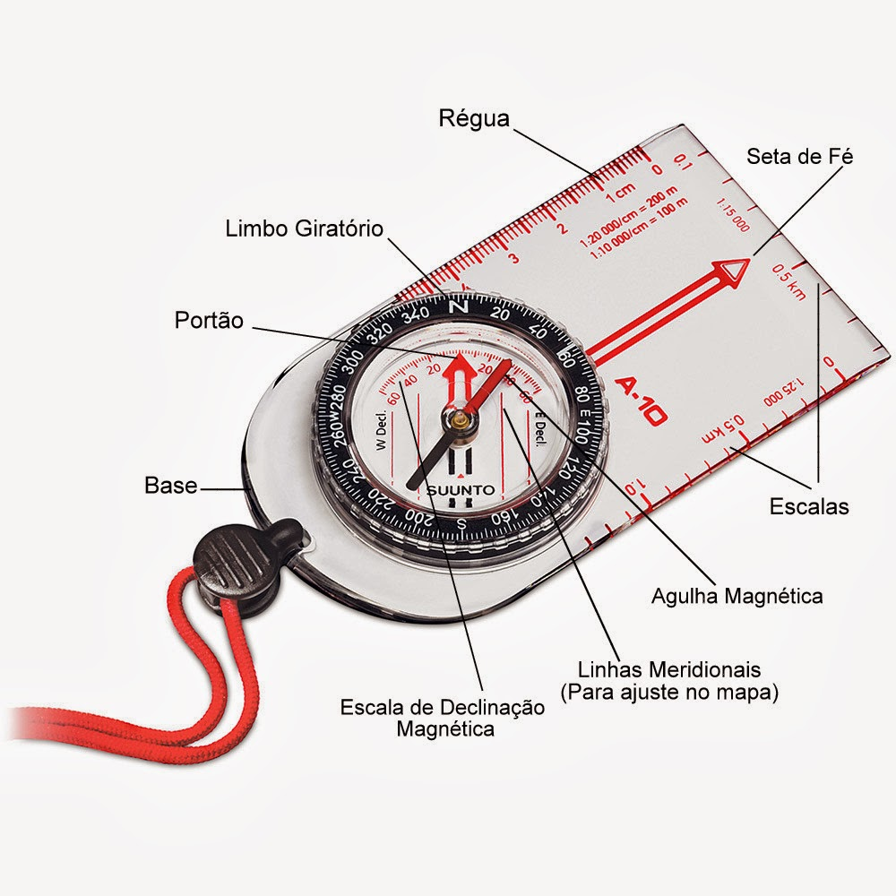

# Orientação

<h4>Núcleo de Leiria</h4><h4>Manual de Orientação</h4>

## Termos Importantes

**Elevação**: É a altura de um ponto da superfície da Terra em relação ao nível do mar.

**Azimute**: É um ângulo usado em navegação ou astronomia que mede a direção de um objeto celeste ou geográfico a partir do norte verdadeiro, girando no sentido horário.

**Curvas de Nível**: São linhas em um mapa que conectam pontos de igual elevação. Elas são usadas para representar a topografia e a inclinação do terreno.

**Norte Magnético**: É a direção para a qual a agulha de uma bússola aponta, influenciada pelo campo magnético da Terra. Ele não coincide exatamente com o norte geográfico devido às variações magnéticas da Terra.

**Norte Verdadeiro**: É a direção exata do polo Norte geográfico a partir de um dado ponto. É usado como referência para navegação e em mapas.

**Declinação**: Também conhecida como variação magnética, é a diferença angular entre o norte magnético e o norte verdadeiro. Varia de acordo com a localização geográfica e ao longo do tempo devido a mudanças no campo magnético da Terra.

**Escala**: A escala indica a relação proporcional entre a distância no mapa e a distância correspondente na realidade. Por exemplo, uma escala de 1:10000 significa que 1 centímetro no mapa representa 100 metros no terreno real. As escalas que vão mais regularmente encontrar são de 1:25000 (1cm no mapa representa 250m), e 1:50000(1cm no mapa representa 500m).

**Medida**: Refere-se ao ato de determinar a extensão, tamanho, quantidade ou capacidade de algo usando unidades padrão ou instrumentos de medição.

**Distância**: É o espaço entre dois pontos ou objetos. Em geografia, é frequentemente medida em unidades como metros ou quilômetros.

**Formato do terreno**: Refere-se às características físicas e à configuração da superfície do terreno, incluindo montanhas, vales, planícies e outros relevos.

**Azimute dorsal**: Este termo não é padrão em geografia ou cartografia. Pode ser um erro de transcrição ou um termo muito específico de uma área particular. Se você tiver um contexto específico onde encontrou este termo, posso tentar ajudar mais detalhadamente.

## Mapa Topográfico

#### O que é um mapa topográfico

#### Utilidade de um mapa topográfico

#### Caracteristicas de um mapa topográfico

#### Simbologia presente num mapa topográfico

## Bússola

#### Nomenclatura de uma bússola:

Os elementos de uma bússola que precisam de saber são os seguintes:

- **Agulha Magnética**: Parte da bússola que aponta para o norte magnético.
- **Limbo**: Disco rotativo graduado em 360° que indica a direção.
- **Cápsula**: Contém o líquido amortecedor e a agulha magnética.
- **Alvo de Visada (ou mira)**: Usado para alinhar a bússola com objetos distantes.
- **Marca de Norte no Limbo**: Indica o norte no disco rotativo.
- **Escala Base**: Escalas lineares para medir distâncias no mapa.
- **Linha de Fé (ou linha de rumo)**: Linha no fundo da cápsula que se alinha com o norte magnético quando a bússola está nivelada.
- **Janela de leitura do azimute**: Onde o azimute (ou rumo) é lido diretamente.

Na figura 1, conseguem ver onde essas diferentes partes

<strong>Figura 1 - </strong> Bússola legendada

#### Como ler um azimute na bússola

#### Como tirar um azimute magnético

#### Como seguir um azimute magnético

## +Info

#### **REQUISITOS**

1. Explicar o que é um mapa topográfico, o que se pode encontrar nele e três utilidades para o mesmo.
2. Identificar pelo menos 20 sinais e símbolos usados em mapas topográficos
3. Apresentar a nomenclatura de uma bússola.
4. [Conhecer e explicar os termos a seguir:](#Termos-Importantes)
   - Elevação
   - Azimute
   - Curvas de Nível
   - Norte Magnético
   - Norte Verdadeiro
   - Declinação
   - Escala
   - Medida
   - Distância
   - Formato do terreno
   - Azimute dorsal
5. Demonstrar como tirar um azimute magnético.
6. Demonstrar como seguir um azimute magnético.
7. Conhecer dois métodos de correção para a declinação e quando esta correção é necessária.
8. Ser capaz de orientar-se usando um mapa e uma bússola.
9. Provar sua habilidade de usar mapas e bússolas, realizando uma caminha de 3 quilómetros pelo campo, com pelo menos 5 leituras de bússola ou pontos de controle.

####   Recursos adicionais:

Estão aqui alguns links que podem ser interessantes se quiserem explorar mais coisas sobre orientação:

- [https://cesad.ufs.br/ORBI/public/uploadCatalago/11205204042012Cartografia_Basica_Aula_15.pdf](https://cesad.ufs.br/ORBI/public/uploadCatalago/11205204042012Cartografia_Basica_Aula_15.pdf)

  by David Batista
  

  	version 0.1
    check the latest version at
    <a href="https://prayerdb.github.io/orientacao">https://prayerdb.github.io/orientacao</a>
  

